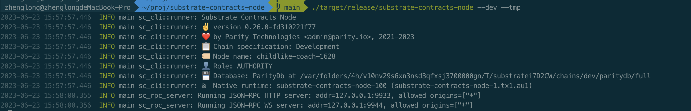
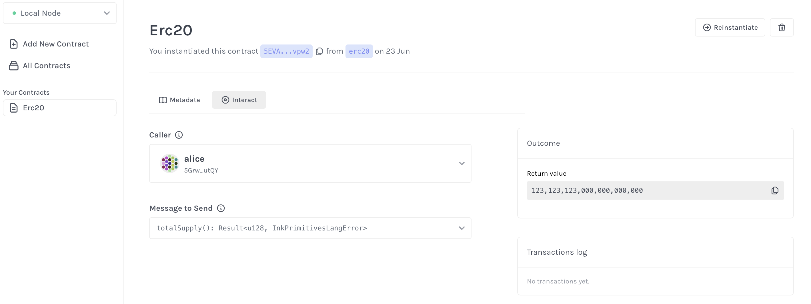
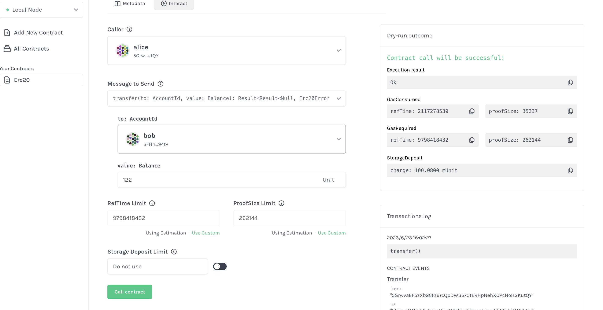

Substrate ink playground

# 1. 编译合约

```sh
cd erc20
cargo contract build
```

# 2. 启动链

```sh
cd ../substrate-contracts-node
cargo build --release
./target/release/substrate-contracts-node --dev --tmp
```



# 3. expand 

```sh
cargo expand --lib > out.rs
```

# 4. unit test

```sh
cargo test
```

# 5. e2e test
```
# Install 'substrate-contracts-node' on the PATH, 
# or specify the `CONTRACTS_NODE` environment variable.
export CONTRACTS_NODE=~/proj/substrate-contracts-node/target/release/substrate-contracts-node
cargo test --features e2e-tests
```

# 6. total suply



# 7. transfer


